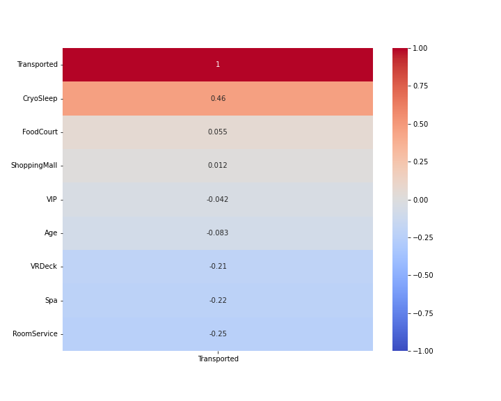
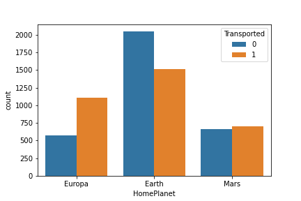
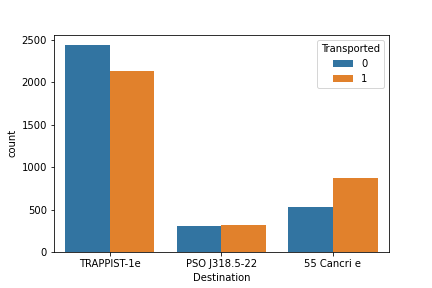
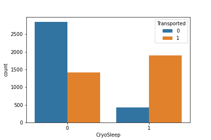
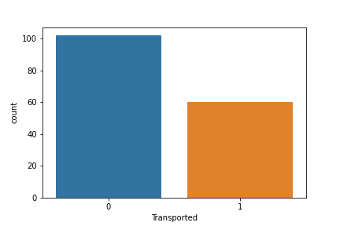
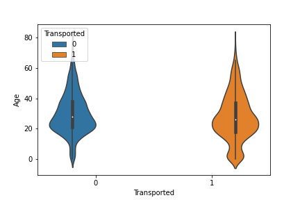

# spaceship-titanic-kaggle-project

## Overview

This is a Kaggle project found at this link [Kaggle](https://www.kaggle.com/competitions/spaceship-titanic). The summary of the project can be found here:

"Welcome to the year 2912, where your data science skills are needed to solve a cosmic mystery. We've received a transmission from four lightyears away and things aren't looking good.

The Spaceship Titanic was an interstellar passenger liner launched a month ago. With almost 13,000 passengers on board, the vessel set out on its maiden voyage transporting emigrants from our solar system to three newly habitable exoplanets orbiting nearby stars.

While rounding Alpha Centauri en route to its first destination—the torrid 55 Cancri E—the unwary Spaceship Titanic collided with a spacetime anomaly hidden within a dust cloud. Sadly, it met a similar fate as its namesake from 1000 years before. Though the ship stayed intact, almost half of the passengers were transported to an alternate dimension!

To help rescue crews and retrieve the lost passengers, you are challenged to predict which passengers were transported by the anomaly using records recovered from the spaceship’s damaged computer system.

Help save them and change history!"

The data sets were provided by the project.

## Cleaning the Data

The data was for the most part clean. For the training data, I just removed the null data. For the testing data, I replaced the null values with the columns average. The reason I made these decisions was that for the training data I wanted the most accurate model posible, so I didn't want to infer anything. Luckily, there wasn't too many deleted rows from this.

I wanted the same for the testing data. However, this wasn't posible as the assignment required that every passenger was accounted for. So, I made the missing values the average, as that seemed like the most accurate way of determining the correct outcome.

## EDA

Before actually making the model, I wanted to do some exploritory data analysis. The first place to start I figured was a heatmap. This heatmap is designed to find which variables best correlated with whether a passanger was transported or not.

The biggest indicator of weather the passenger was transported, according to our heat map, is if they had elected to be put into suspended animation during the voyage.

The next thing to look at are some count plots of different variable types to see if any effected the journey. Let's start with home planet. Some passangers started from Earth, others Europa, and the last group was from Mars. Here is what we found:

People from Europa were likely to be transported while people from Earth were not. People from Mars were in the middle.

Similar to how we have 3 home planets, we have 3 destinations. Here is how they effected transportation rates:

The destination doesn't seem to make a difference if it is to PSO J318.5-22. There is a slight chance higher of not being transported if the destination is to Trappist-1e. One has a higher chance of being transported if the destination is 55 Cancri e.

Some people opted into doing the trip in cryo sleep. This is a form of frozen hibernation were the person is awaken once the trip is over. Here is how it effected the transportation rate:

What we found earlier in the heat map that participating in CryoSleep greatly increases the chance of being transported is confirmed here.

Some customers opted to be VIP guests on the Space Titanic. Let's see how that effected there chance of being transported:

Surprisingly, paying for a VIP service actually decreases ones chance of being transported.

I wanted to look at the age distribution of those who were transported and those who were not. I did this with a violin plot. Here is my finding:

The most noticiable difference in these plots is that young people are more likely too be transported. Checking the averages, this is true by, on average, 2.4 years.

## Modeling and Analysis
